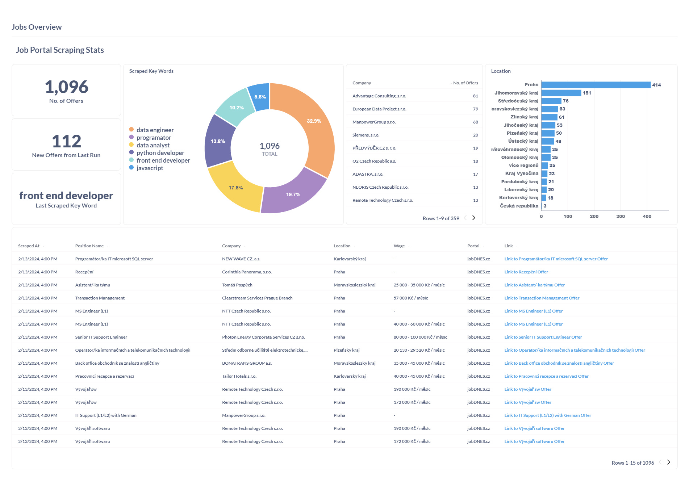
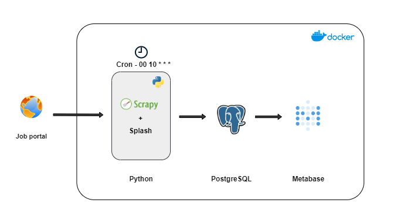

# ScrapyJobCrawler: Automated Job Scraping with Scrapy, Splash and Docker

## Technologies Used:

- Python
- Scrapy
- Docker
- Splash
- PostgreSQL
- Metabase
- Cron

## Overview:
ScrapyJobCrawler is a  scraping project designed to automate the extraction of job listings from JoDNES job portal.
**Disclaimer:** Potential future changes to the structure of the portal's website may cause the scrapy crawl to break

## Key Features:
- **Customizable Configuration:** Users can tailor the scraping parameters to their preferences by specifying the desired position name or keyword in the **scrapy.cfg** configuration file.
 

- **Dynamic Scraping:** During execution, the Scrapy spider dynamically loads configuration variable (where the desired position/key word to scrape is specified), submits them to the website's search field using Splash, and scrapes the returned job offers.
 

- **Automated Execution:** A cron job orchestrated within the container ensures that the scraping process runs automatically when the container is launched and once a day at 10 AM UTC, providing users with up-to-date job listings.
 

- **Data Visualization:** Utilizing Metabase, the project offers powerful visualization capabilities, allowing users to gain insights from the scraped job data.
 

- **Seamless Docker Containerization:** The project is containerized using Docker, with four distinct containers (Splash, Metabase, PostgreSQL, and Python) 

## Usage:
1. Configure the `'key_word'` parameter in the **scrapy.cfg** file.
2. Run `docker compose up`
3. Go to http://localhost:3000/dashboard/1-jobs-overview to access the Metabase dashboard 

**Metabase credentials:** 
- login: user@user.com
- password: user5432

